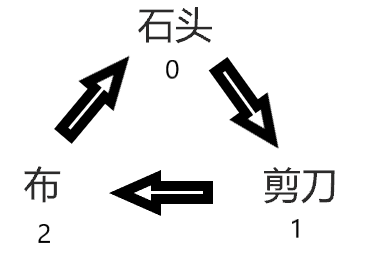

# 猜拳游戏

规则：

1. 胜利的手势&rarr;失败的手势，如图：

2. 胜负的判定

|胜负|human|comp|human - comp|(human - comp + 3) % 3|
|---|:---:|:---:|:---:|:---:|
|平局|0|0|0|0|
||1|1|0|0|
||2|2|0|0|
|失败|0|2|-2|1|
||1|0|1|1|
||2|1|1|1|
|胜利|0|1|-1|2|
||1|2|-1|2|
||2|0|2|2|

